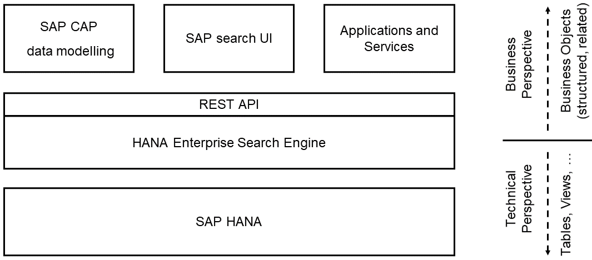

This enterprise search engine example program shows how to utilize [SAP HANA Search](https://help.sap.com/docs/SAP_HANA_PLATFORM/691cb949c1034198800afde3e5be6570 "HANA search developer guide") which is part of both, cloud and on-premise shipments, of [SAP HANA DB](https://www.sap.com/products/hana.html). It provides REST-APIs for search and CRD (create, read, delete) to process structured business objects and their relationships. To do so, it maps this business perspective to a technical perspective which is then processed by HANA. [SAP CAP](https://cap.cloud.sap) can be used to model the business objects and their relationships. The example also shows how to use the enterprise search UI which is delivered as part of SAP UI5. Programming language is Python.




# Getting Started
## Requirements
- Up-to date SAP HANA (on-prem or cloud)
- Latest version of [Python 3.10](https://www.python.org/downloads/ "download")
- [SAP CAP](https://cap.cloud.sap/docs/get-started/ "getting started")

### Additional requirements for development
- [Visual Studio Code](https://code.visualstudio.com/download "download")
- [SAP CDS language support for Visual Studio Code](https://cap.cloud.sap/docs/tools/#add-cds-editor)
- Python linting as described [here](https://code.visualstudio.com/docs/python/linting)


## Download and Installation
Clone or download this repository for example to c:\devpath\hana-enterprise-search-engine. 

Then open a console and change to the download path:
```bat
c:\ cd c:\devpath\hana-enterprise-search-engine
```

Create a python virtual environment named .venv:
```bat
c:\devpath\hana-enterprise-search-engine> python -m venv .venv
```

Activate the python virtual environment:
```bat
c:\devpath\hana-enterprise-search-engine> .venv\scripts\activate
```

If the environment is activated correctly, a previx (.venv) is shown in the command line:
```bat
(.venv) c:\devpath\hana-enterprise-search-engine>
```


Install the required Python packages:
```bat
(.venv) c:\devpath\hana-enterprise-search-engine> python -m pip install -r requirements/core.txt
```
Install additional Python packages if this installation is used for development:
```bat
(.venv) c:\devpath\hana-enterprise-search-engine> python -m pip install -r requirements/development.txt
```


### Configuration
An admin-user is needed with the following privileges:
- system privilege CREATE SCHEMA (grantable to other users and roles)
- system privilege USER ADMIN
- object privilege ESH_CONFIG execute (grantable to others)

Configuration is done with the config.py script using the following parameters
- --action install
- --db-host: The HANA host name
- --db-port: The HANA port number
- --db-setup-user: The HANA user name used for setup
- --db-setup-password: The HANA user password for the seup-user. Note: This user-name and passwords are not stored
- --db-schema-prefix: The prefix which is used for the schemas of this installation. To avoid conflicts, there must not be any other schemas on the database starting with this schema prefix.

```bat
c:\devpath\hana-enterprise-search-engine> python src/config.py --action install --db-host <<your_hana_host>> --db-port <<your_hana_port>> --db-setup-user <<your HANA admin user>> --db-setup-password <<your HANA admin password>> --db-schema-prefix <<your HANA >>

```
The configuration will create some HANA DB users and the src/.config.json file which contains configuration information and users and passwords created for the installation (needed e.g. for debugging purposes). Please do not change the src/.config.json file.

The default settings for the web-server (host 127.0.0.1 and port 8000) can be changed using parameters srv-host and srv-port.


To uninstall run the following command:

```bat
c:\devpath\hana-enterprise-search-engine> python src/config.py --action delete --db-setup-user <<your HANA admin user>> --db-setup-password <<your HANA admin password>>
```
Attention: This will delete ALL data of this installation!

### Start server
Start the server in the console with the activated virtual environment:
```bat
c:\ cd c:\devpath\hana-enterprise-search-engine
c:\devpath\hana-enterprise-search-engine> .venv\scripts\activate
(.venv) c:\devpath\hana-enterprise-search-engine> python src\server.py
```

The message "Application startup complete" indicates a successful server startup.

### Run end-to-end test

```bat
(.venv) c:\devpath\hana-enterprise-search-engine> python tests\packages\run_tests.py
```
The test script prints a success-message in the last output line if all tests are executed successfully.

# APIs

The enterprise search engine provides the following APIs:

| Functionality | HTTP method | URL | URL parameters | Request Body | Response Body | API maturity |
| :-------------: | :-----------: | :----:  | :----:  | :----:    | :----:    | :----:    |
| Create tenant | POST | /v1/tenant/{tenant-id} | - | - | status | \** |
| Get all tenants | GET | /v1/tenant | - | - | tenants | \** |
| Delete tenant | DELETE | /v1/tenant/{tenant-id} | - | - | status | \** |
| Deploy data model | POST | /v1/deploy/{tenant-id} | - | model | status | \** |
| Create data | POST | /v1/data/{tenant-id} | - | objects | identifiers | \** |
| Read data | POST | /v1/read/{tenant-id} | - | identifiers | objects | \** |
| Delete data | DELETE | /v1/data/{tenant-id} | - | identifiers | - | \** |
| Search (OData format) | GET | /v1/search/{tenant-id}/{esh-version} | query | - | - | \**** |
| Get metadata (OData format) | GET | /v1/search/{tenant-id}/{esh-version}/$metadata | - | - | metadata | \**** |
| Bulk Search (OData format) | POST | /v1/search/{tenant-id}/{esh-version} | - | query | result | \**** |
| Search UI | GET | /v1/searchui/{tenant-id} | query | - | - | \**** |
| Search (new request format) | POST | /v2/search/{tenant-id}/{esh-version} | - | query | result | \* |

API maturity:

\* ... experimental, expect major changes / rework, 

\** ... in development, API changes and bugs expected

\*** ... stable API, good error handling

\**** ... used in production since years

[This](\tests\packages\run_tests.py) test program demonstrates the API usage based on a test example.


### Create tenant
| Functionality | HTTP method | URL | URL parameters | Request Body | Response Body | API maturity |
| :-------------: | :-----------: | :----:  | :----:  | :----:    | :----:    | :----:    |
| Create tenant | POST | /v1/tenant/{tenant-id} | - | - | status | \** |

A new tenant is created with this call. The tenant-id needs to be alphanumeric and has a maximal length of 50 characters.

#### Example Request URL:

`POST /v1/tenant/testtenant01`

#### Example Response Body:

```json
{
        "detail": "Tenant 'testtenant01' successfully created"
}
```

### Get all tenants
| Functionality | HTTP method | URL | URL parameters | Request Body | Response Body | API maturity |
| :-------------: | :-----------: | :----:  | :----:  | :----:    | :----:    | :----:    |
| Get all tenants | GET | /v1/tenant | - | - | tenants | \** |

#### Request URL:

`GET /v1/tenant`

#### Example Response:
```json

[
    {
        "name": "testtenant01",
        "createdAt": "2022-07-06T14:06:30.579000"
    }
]
```

### Delete tenant
| Functionality | HTTP method | URL | URL parameters | Request Body | Response Body | API maturity |
| :-------------: | :-----------: | :----:  | :----:  | :----:    | :----:    | :----:    |
| Delete tenant | DELETE | /v1/tenant/{tenant-id} | - | - | status | \** |

#### Example Request URL:

`DELETE /v1/tenant/testtenant01`

#### Example Response:
```json
{
        "detail": "Tenant 'testtenant01' successfully deleted"
}
```

### Deploy data model
| Functionality | HTTP method | URL | URL parameters | Request Body | Response Body | API maturity |
| :-------------: | :-----------: | :----:  | :----:  | :----:    | :----:    | :----:    |
| Deploy data model | POST | /v1/deploy/{tenant-id} | - | model | status | \** |

Modelling is done with CAP tools which create a .cds file.
#### Example CDS file
This example shows a simple person object with two properties, firstName and lastName. The example shows already some search annotations which are used to control search execution in a fine-granular way. More information about annotations can be found in the section
[Annotations for sys.esh_config()](https://help.sap.com/docs/SAP_HANA_PLATFORM/691cb949c1034198800afde3e5be6570/2dd342f3ec984869ae619cbaf31e3aa1.html?locale=en-US&q=Annotations%20for%20sys.esh_config%28%29) of the HANA search developer guide.
```cds
using {sap.esh.Identifier} from '../../../model/esh';
namespace example;

@EndUserText.Label: 'Person'
entity Person: Identifier {
    @EndUserText.Label: 'First Name'
    @Search.fuzzinessThreshold: 0.85
    firstName: String(256);
    @EndUserText.Label: 'Last Name'
    @Search.fuzzinessThreshold: 0.85
    lastName: String(256);
}
```
#### Converting CDS into CSON
Modeling can be done with CAP CDS. The cds-file needs to be converted into a cson-file which is the parsed cds file in JSON format. After installation (see below) either the cds compiler or the CDS preview in VS code can be used.

```bat
cds compile model.cds --to json > cson.json
```

#### Example Request URL:

`POST /v1/deploy/testtenant01`

#### Request Body:
The request body is the cson json created with the cds compiler as shown above.

```json
{
    "namespace": "example",
    "definitions": {
        "example.Person": {
            "kind": "entity",
            "@EndUserText.Label": "Person",
            "includes": [
                "sap.esh.Identifier"
            ],
            "elements": {
                "id": {
                    "key": true,
                    "type": "cds.UUID"
                },
                "source": {
                    "items": {
                        "elements": {
                            "name": {
                                "type": "cds.String",
                                "length": 4000
                            },
                            "type": {
                                "type": "cds.String",
                                "length": 4000
                            },
                            "sid": {
                                "type": "cds.String",
                                "length": 4000
                            }
                        }
                    }
                },
                "firstName": {
                    "@EndUserText.Label": "First Name",
                    "@Search.fuzzinessThreshold": 0.85,
                    "type": "cds.String",
                    "length": 256
                },
                "lastName": {
                    "@EndUserText.Label": "Last Name",
                    "@Search.fuzzinessThreshold": 0.85,
                    "type": "cds.String",
                    "length": 256
                }
            }
        },
        "sap.esh.Identifier": {
            "kind": "aspect",
            "elements": {
                "id": {
                    "key": true,
                    "type": "cds.UUID"
                },
                "source": {
                    "items": {
                        "elements": {
                            "name": {
                                "type": "cds.String",
                                "length": 4000
                            },
                            "type": {
                                "type": "cds.String",
                                "length": 4000
                            },
                            "sid": {
                                "type": "cds.String",
                                "length": 4000
                            }
                        }
                    }
                }
            }
        }
    },
    "$version": "2.0"
}
```


Example Response:
```json
{
    "detail": "Model successfully deployed"
}
```

### Create data
| Functionality | HTTP method | URL | URL parameters | Request Body | Response Body | API maturity |
| :-------------: | :-----------: | :----:  | :----:  | :----:    | :----:    | :----:    |
| Create data | POST | /v1/data/{tenant-id} | - | objects | identifiers | \** |

The request body contains a list of objects per object type. The response body contains the generated internal ids.

#### Example Request URL:
`POST /v1/data/testtenant01`


#### Example Request Body:
```json
{
    "example.Person": [
        {
            "firstName": "Max",
            "lastName": "Mustermann"
        },
        {
            "lastName": "Musterfrau",
            "firstName": "Maximilia"
        }
    ]
}
```

#### Example Response Body:
```json
{
    "example.Person": [
        {
            "id": "7c12b1bd-fd50-11ec-b709-84fdd15e54d3"
        },
        {
            "id": "7c12b1be-fd50-11ec-bd49-84fdd15e54d3"
        }
    ]
}
```


### Read data
| Functionality | HTTP method | URL | URL parameters | Request Body | Response Body | API maturity |
| :-------------: | :-----------: | :----:  | :----:  | :----:    | :----:    | :----:    |
| Read data | POST | /v1/read/{tenant-id} | - | identifiers | objects | \** |

#### Example Request URL:
`POST /v1/read/testtenant01`


#### Example Request Body:
```json
{
    "example.Person": [
        {
            "id": "7c12b1bd-fd50-11ec-b709-84fdd15e54d3"
        },
        {
            "id": "7c12b1be-fd50-11ec-bd49-84fdd15e54d3"
        }
    ]
}
```


#### Example Response Body:
```json
{
    "example.Person": [
        {
            "id": "7c12b1bd-fd50-11ec-b709-84fdd15e54d3",
            "firstName": "Max",
            "lastName": "Mustermann"
        },
        {
            "id": "7c12b1be-fd50-11ec-bd49-84fdd15e54d3",
            "firstName": "Maximilia",
            "lastName": "Musterfrau"
        }
    ]
}
```


### Delete data
| Functionality | HTTP method | URL | URL parameters | Request Body | Response Body | API maturity |
| :-------------: | :-----------: | :----:  | :----:  | :----:    | :----:    | :----:    |
| Delete data | DELETE | /v1/data/{tenant-id} | - | identifiers | - | \** |

#### Example Request URL:
`DELETE /v1/data/testtenant01`

#### Example Request Body:
```json
{
    "example.Person": [
        {
            "id": "7c12b1bd-fd50-11ec-b709-84fdd15e54d3"
        },
        {
            "id": "7c12b1be-fd50-11ec-bd49-84fdd15e54d3"
        }
    ]
}
```

#### Example Response Body:
```json
null
```

### Search (OData format)
| Functionality | HTTP method | URL | URL parameters | Request Body | Response Body | API maturity |
| :-------------: | :-----------: | :----:  | :----:  | :----:    | :----:    | :----:    |
| Search (OData format) | GET | /v1/search/{tenant-id}/{esh-version} | query | - | - | \**** |

More information about the search URL parameters can be found in the section [federated Full-Text Search with Built-In Procedure sys.esh_search()](https://help.sap.com/docs/SAP_HANA_PLATFORM/691cb949c1034198800afde3e5be6570/bff7cffd72074c6e80d4c21279f5a521.html?locale=en-US) of the HANA search developer guide.


#### Example Request URL:
`GET /v1/search/testtenant01/latest/"$all?$top=10&$count=true&$apply=filter(Search.search(query='SCOPE:EXAMPLEPERSON AND Max AND Mustermann'))&whyfound=true&$select=FIRSTNAME,LASTNAME&$orderby=LASTNAME ASC&estimate=true&wherefound=true"`

#### Example Response Body:
```json
[
    {
        "value": [
            {
                "@com.sap.vocabularies.Search.v1.Ranking": 1,
                "@com.sap.vocabularies.Search.v1.WhereFound": "<TERM>Max</TERM><FOUND>FIRSTNAME</FOUND><TERM>Mustermann</TERM><FOUND>LASTNAME</FOUND>",
                "@com.sap.vocabularies.Search.v1.WhyFound": {
                    "FIRSTNAME": [
                        "<b>Max</b>"
                    ],
                    "LASTNAME": [
                        "<b>Mustermann</b>"
                    ]
                },
                "@odata.context": "$metadata#EXAMPLEPERSON",
                "FIRSTNAME": "Max",
                "LASTNAME": "Mustermann"
            }
        ],
        "@odata.count": 1,
        "@com.sap.vocabularies.Search.v1.ResponseTime": 0,
        "@com.sap.vocabularies.Search.v1.SearchTime": 0,
        "@com.sap.vocabularies.Search.v1.SearchStatistics": {
            "ConnectorStatistics": [
                {
                    "OdataID": "EXAMPLEPERSON",
                    "StatusCode": 200,
                    "@com.sap.vocabularies.Search.v1.SearchTime": 0,
                    "@com.sap.vocabularies.Search.v1.CPUTime": 0
                }
            ],
            "StatusCode": 200
        }
    }
]
```


### Get metadata (OData format)
| Functionality | HTTP method | URL | URL parameters | Request Body | Response Body | API maturity |
| :-------------: | :-----------: | :----:  | :----:  | :----:    | :----:    | :----:    |
| Get metadata (OData format) | GET | /v1/search/{tenant-id}/{esh-version}/$metadata | - | - | metadata | \**** |

This is the standard OData $metadata call to get the current metadata information in XML format.
#### Example Request URL:
`GET /v1/search/testtenant01/latest/$metadata`

```xml
This XML file does not appear to have any style information associated with it. The document tree is shown below.
<edmx:Edmx
	xmlns:edmx="http://docs.oasis-open.org/odata/ns/edmx" Version="4.0">
	<edmx:DataServices>
		<Schema
			xmlns="http://docs.oasis-open.org/odata/ns/edm" Namespace="esh">
			<EntityType Name="EXAMPLEPERSONType">
				<Annotation Term="Search.searchable" Bool="true"/>
				<Annotation Term="EnterpriseSearch.enabled" Bool="true"/>
				<Annotation Term="EnterpriseSearch.hidden" Bool="false"/>
				<Key>
					<PropertyRef Name="ID"/>
				</Key>
				<Annotation Term="EndUserText.Label" String="Person"/>
				<Annotation Term="SAP.Common.Label" String="Person"/>
				<Property Name="FIRSTNAME" Type="Edm.String" MaxLength="256">
					<Annotation Term="Search.defaultSearchElement" Bool="true"/>
					<Annotation Term="Search.fuzzinessThreshold" Decimal="0.85"/>
					<Annotation Term="EnterpriseSearchHana.isSortable" Bool="true"/>
					<Annotation Term="EndUserText.Label" String="First Name"/>
					<Annotation Term="SAP.Common.Label" String="First Name"/>
					<Annotation Term="UI.identification">
						<Collection>
							<Record>
								<PropertyValue Property="position" Int="10"/>
							</Record>
						</Collection>
					</Annotation>
				</Property>
				<Property Name="ID" Type="Edm.String" MaxLength="36">
					<Annotation Term="EnterpriseSearch.key" Bool="true"/>
					<Annotation Term="EnterpriseSearchHana.isSortable" Bool="true"/>
					<Annotation Term="UI.hidden" Bool="true"/>
					<Annotation Term="SAP.Common.Label" String="ID"/>
				</Property>
				<Property Name="LASTNAME" Type="Edm.String" MaxLength="256">
					<Annotation Term="Search.defaultSearchElement" Bool="true"/>
					<Annotation Term="Search.fuzzinessThreshold" Decimal="0.85"/>
					<Annotation Term="EnterpriseSearchHana.isSortable" Bool="true"/>
					<Annotation Term="EndUserText.Label" String="Last Name"/>
					<Annotation Term="SAP.Common.Label" String="Last Name"/>
					<Annotation Term="UI.identification">
						<Collection>
							<Record>
								<PropertyValue Property="position" Int="20"/>
							</Record>
						</Collection>
					</Annotation>
				</Property>
				<Property Name="SOURCE_NAME" Type="Edm.String" MaxLength="4000">
					<Annotation Term="Search.defaultSearchElement" Bool="true"/>
					<Annotation Term="EnterpriseSearchHana.isSortable" Bool="true"/>
					<Annotation Term="SAP.Common.Label" String="SOURCE_NAME"/>
				</Property>
				<Property Name="SOURCE_SID" Type="Edm.String" MaxLength="4000">
					<Annotation Term="Search.defaultSearchElement" Bool="true"/>
					<Annotation Term="EnterpriseSearchHana.isSortable" Bool="true"/>
					<Annotation Term="SAP.Common.Label" String="SOURCE_SID"/>
				</Property>
				<Property Name="SOURCE_TYPE" Type="Edm.String" MaxLength="4000">
					<Annotation Term="Search.defaultSearchElement" Bool="true"/>
					<Annotation Term="EnterpriseSearchHana.isSortable" Bool="true"/>
					<Annotation Term="SAP.Common.Label" String="SOURCE_TYPE"/>
				</Property>
			</EntityType>
			<EntityContainer Name="esh">
				<EntitySet Name="EXAMPLEPERSON" EntityType="esh.EXAMPLEPERSONType">
					<Annotation String="EXAMPLEPERSON" Term="SAP.Common.Label"/>
				</EntitySet>
			</EntityContainer>
		</Schema>
	</edmx:DataServices>
</edmx:Edmx>
```

### Bulk Search (OData format)
| Functionality | HTTP method | URL | URL parameters | Request Body | Response Body | API maturity |
| :-------------: | :-----------: | :----:  | :----:  | :----:    | :----:    | :----:    |
| Bulk Search (OData format) | POST | /v1/search/{tenant-id}/{esh-version} | - | query | result | \**** |

Many search requests can be sent in a list.
#### Example Request URL:
`POST /v1/search/testtenant01/latest`

#### Example Request Body:
```json
[
    "$all?$top=10&$count=true&$apply=filter(Search.search(query='SCOPE:EXAMPLEPERSON AND (Max AND Mustermann) AND aaa AND bbb'))&whyfound=true&$select=FIRSTNAME,LASTNAME&$orderby=LASTNAME ASC&estimate=true&wherefound=true",
    "$all?$top=10&$count=true&$apply=filter(Search.search(query='SCOPE:EXAMPLEPERSON AND Max AND Mustermann'))&whyfound=true&$select=FIRSTNAME,LASTNAME&$orderby=LASTNAME ASC&estimate=true&wherefound=true"
]
```

#### Example Response Body:
```json
[
    {
        "value": [],
        "@odata.count": 0,
        "@com.sap.vocabularies.Search.v1.ResponseTime": 0,
        "@com.sap.vocabularies.Search.v1.SearchTime": 0,
        "@com.sap.vocabularies.Search.v1.SearchStatistics": {
            "ConnectorStatistics": [
                {
                    "OdataID": "EXAMPLEPERSON",
                    "StatusCode": 200,
                    "@com.sap.vocabularies.Search.v1.SearchTime": 0,
                    "@com.sap.vocabularies.Search.v1.CPUTime": 0
                }
            ],
            "StatusCode": 200
        }
    },
    {
        "value": [
            {
                "@com.sap.vocabularies.Search.v1.Ranking": 1,
                "@com.sap.vocabularies.Search.v1.WhereFound": "<TERM>Max</TERM><FOUND>FIRSTNAME</FOUND><TERM>Mustermann</TERM><FOUND>LASTNAME</FOUND>",
                "@com.sap.vocabularies.Search.v1.WhyFound": {
                    "FIRSTNAME": [
                        "<b>Max</b>"
                    ],
                    "LASTNAME": [
                        "<b>Mustermann</b>"
                    ]
                },
                "@odata.context": "$metadata#EXAMPLEPERSON",
                "FIRSTNAME": "Max",
                "LASTNAME": "Mustermann"
            }
        ],
        "@odata.count": 1,
        "@com.sap.vocabularies.Search.v1.ResponseTime": 0,
        "@com.sap.vocabularies.Search.v1.SearchTime": 0,
        "@com.sap.vocabularies.Search.v1.SearchStatistics": {
            "ConnectorStatistics": [
                {
                    "OdataID": "EXAMPLEPERSON",
                    "StatusCode": 200,
                    "@com.sap.vocabularies.Search.v1.SearchTime": 0,
                    "@com.sap.vocabularies.Search.v1.CPUTime": 0
                }
            ],
            "StatusCode": 200
        }
    }
]
```

### Search (new request format)
| Functionality | HTTP method | URL | URL parameters | Request Body | Response Body | API maturity |
| :-------------: | :-----------: | :----:  | :----:  | :----:    | :----:    | :----:    |
| Search (new request format) | POST | /v2/search/{tenant-id}/{esh-version} | - | query | result | \* |

This is an experimental format using a JSON-serialized version of the search request.
#### Example Request URL:
`POST /v2/search/testtenant01/latest`

#### Example Request Body:
```json
[
    {
        "top": 10,
        "count": true,
        "searchQueryFilter": {
            "type": "Expression",
            "items": [
                {
                    "type": "ScopeComparison",
                    "values": [
                        "EXAMPLEPERSON"
                    ]
                },
                {
                    "type": "Expression",
                    "items": [
                        {
                            "type": "StringValue",
                            "value": "Max",
                            "is_quoted": false,
                            "is_single_quoted": false,
                            "without_enclosing": false
                        },
                        {
                            "type": "StringValue",
                            "value": "Mustermann",
                            "is_quoted": false,
                            "is_single_quoted": false,
                            "without_enclosing": false
                        }
                    ],
                    "operator": "AND"
                },
                {
                    "type": "StringValue",
                    "value": "aaa",
                    "is_quoted": false,
                    "is_single_quoted": false,
                    "without_enclosing": false
                },
                {
                    "type": "StringValue",
                    "value": "bbb",
                    "is_quoted": false,
                    "is_single_quoted": false,
                    "without_enclosing": false
                }
            ],
            "operator": "AND"
        },
        "whyfound": true,
        "select": [
            "FIRSTNAME",
            "LASTNAME"
        ],
        "orderby": [
            {
                "key": "LASTNAME",
                "order": "ASC"
            }
        ],
        "estimate": true,
        "wherefound": true
    },
    {
        "top": 10,
        "count": true,
        "searchQueryFilter": {
            "type": "Expression",
            "items": [
                {
                    "type": "ScopeComparison",
                    "values": [
                        "EXAMPLEPERSON"
                    ]
                },
                {
                    "type": "StringValue",
                    "value": "Max",
                    "is_quoted": false,
                    "is_single_quoted": false,
                    "without_enclosing": false
                },
                {
                    "type": "StringValue",
                    "value": "Mustermann",
                    "is_quoted": false,
                    "is_single_quoted": false,
                    "without_enclosing": false
                }
            ],
            "operator": "AND"
        },
        "whyfound": true,
        "select": [
            "FIRSTNAME",
            "LASTNAME"
        ],
        "orderby": [
            {
                "key": "LASTNAME",
                "order": "ASC"
            }
        ],
        "estimate": true,
        "wherefound": true
    }
]
```

#### Example Response Body:
```json
[
    {
        "value": [],
        "@odata.count": 0,
        "@com.sap.vocabularies.Search.v1.ResponseTime": 0,
        "@com.sap.vocabularies.Search.v1.SearchTime": 0,
        "@com.sap.vocabularies.Search.v1.SearchStatistics": {
            "ConnectorStatistics": [
                {
                    "OdataID": "EXAMPLEPERSON",
                    "StatusCode": 200,
                    "@com.sap.vocabularies.Search.v1.SearchTime": 0,
                    "@com.sap.vocabularies.Search.v1.CPUTime": 0
                }
            ],
            "StatusCode": 200
        }
    },
    {
        "value": [
            {
                "@com.sap.vocabularies.Search.v1.Ranking": 1,
                "@com.sap.vocabularies.Search.v1.WhereFound": "<TERM>Max</TERM><FOUND>FIRSTNAME</FOUND><TERM>Mustermann</TERM><FOUND>LASTNAME</FOUND>",
                "@com.sap.vocabularies.Search.v1.WhyFound": {
                    "FIRSTNAME": [
                        "<b>Max</b>"
                    ],
                    "LASTNAME": [
                        "<b>Mustermann</b>"
                    ]
                },
                "@odata.context": "$metadata#EXAMPLEPERSON",
                "FIRSTNAME": "Max",
                "LASTNAME": "Mustermann"
            }
        ],
        "@odata.count": 1,
        "@com.sap.vocabularies.Search.v1.ResponseTime": 0,
        "@com.sap.vocabularies.Search.v1.SearchTime": 0,
        "@com.sap.vocabularies.Search.v1.SearchStatistics": {
            "ConnectorStatistics": [
                {
                    "OdataID": "EXAMPLEPERSON",
                    "StatusCode": 200,
                    "@com.sap.vocabularies.Search.v1.SearchTime": 0,
                    "@com.sap.vocabularies.Search.v1.CPUTime": 0
                }
            ],
            "StatusCode": 200
        }
    }
]
```


### Search UI
| Functionality | HTTP method | URL | URL parameters | Request Body | Response Body | API maturity |
| :-------------: | :-----------: | :----:  | :----:  | :----:    | :----:    | :----:    |
| Search UI | GET | /v1/searchui/{tenant-id} | query | - | - | \**** |

This request starts the standard SAP enterprise search UI.
